<h1 align="center">
  <a href="https://your-portfolio.vercel.app/">
    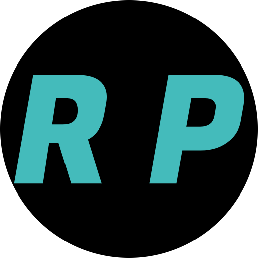
  </a>
  <br>
  <p>Developer Portfolio – Fullstack | Blog | Admin CMS</p>
</h1>

<p align="center">
<a href="#"></a>
<a href="#"></a>
<a href="#"></a>
<a href="#"></a>
<a href="#"></a>
<a href="#"></a>
<a href="#"></a>
<a href="#"></a>
</p>

<p align="center">
  <a href="#overview">Overview</a> •
  <a href="#architecture">Architecture</a> •
  <a href="#features">Features</a> •
  <a href="#project-structure">Project Structure</a> •
  <a href="#technologies-used">Technologies</a> •
  <a href="#installation">Installation</a> •
  <a href="#usage">Usage</a> •
  <a href="#screenshots">Screenshots</a> •
  <a href="#contributing">Contributing</a> •
  <a href="#license">License</a>
</p>

---

## Overview

This is a **modern fullstack developer portfolio** built using **Next.js App Router**, designed to showcase projects, blogs, and experience with a **production-grade architecture**.

It includes:

- Public portfolio (projects, experience, blog)
- Fully dynamic blog system with markdown rendering
- Admin dashboard (CMS-style control panel)
- Authentication system
- API routes + server actions
- Scalable architecture using modular patterns

---

## Architecture

### High-Level Architecture

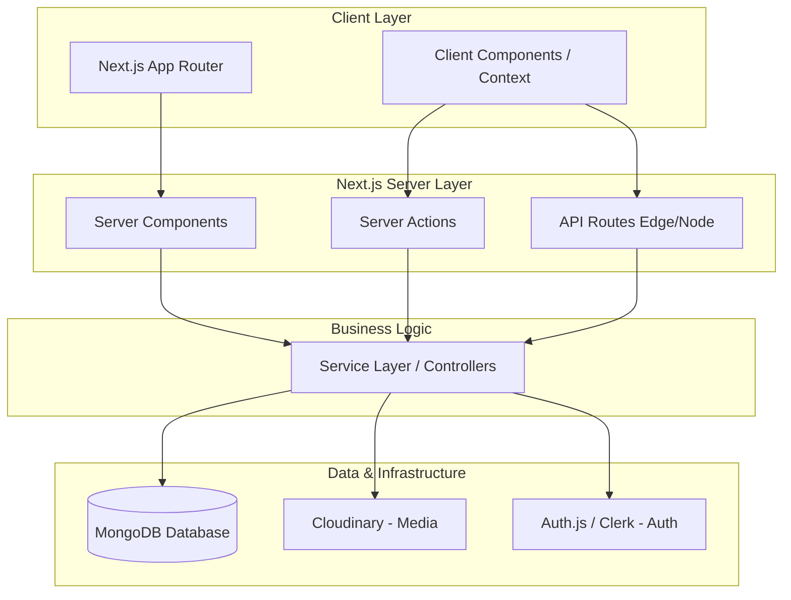

### Architectural Layers

#### 1. Presentation Layer (UI)

- Located in:
  - `/app`
  - `/components`
- Uses:
  - Server Components (default)
  - Client Components (interactive parts)
- Handles:
  - Rendering UI
  - Layouts
  - SEO

#### 2. Application Layer

- Located in:
  - `/app/actions`
  - `/lib/features`
- Handles:
  - Business logic
  - State management (Redux)
  - Server actions

#### 3. API Layer

- Located in:
  - `/app/api`
- Handles:
  - REST endpoints
  - Authentication
  - Data fetching
  - Admin operations

---

#### 4. Domain Layer

- Located in:
  - `/lib/models`
- Defines:
  - Blog
  - Project
  - User schemas

---

#### 5. Infrastructure Layer

- Located in:
  - `/lib/database.ts`
  - `/config/env.ts`
- Handles:
  - DB connection
  - Environment config
  - External services (Cloudinary)

---

## Features

### Portfolio Features

- Dynamic project showcase
- Experience timeline
- SEO optimized pages
- Open Graph image generation (`/api/og`)
- Fully responsive UI

### Blog System

- Markdown-based blog rendering
- Dynamic routing (`[...slug]`)
- Table of contents (auto-generated)
- Search functionality
- Code highlighting
- Blog thumbnails via Cloudinary

### Admin Dashboard

- Manage blogs (CRUD)
- Manage projects
- Manage users
- Secure admin routes
- Modal-based actions (App Router parallel routes)

### Authentication

- NextAuth integration
- Protected routes
- Session handling
- Role-based access (admin/user)

### Developer Experience

- Bun support (fast runtime)
- Modular architecture
- Type-safe APIs
- Reusable UI components
- Clean folder structure

---

## Project Structure

```
app/
├── (front)/           → Public-facing UI (blogs, portfolio)
├── admin/             → Admin dashboard
├── api/               → Backend API routes
├── actions/           → Server actions
├── layout.tsx         → Root layout

components/
├── blog/              → Blog-specific UI
├── admin/             → Admin UI
├── ui/                → Reusable components
├── auth/              → Auth utilities

lib/
├── models/            → Database schemas
├── features/          → Redux logic
├── services/          → Business services
├── utils/             → Helpers

config/
└── env.ts             → Environment config

public/                 → Static assets
styles/                 → Global styles
types/                  → Type definitions

```

---

## Technologies Used

### Frontend

- Next.js (App Router)
- TypeScript
- Tailwind CSS
- Framer Motion (UI animations)

### Backend

- Next.js API Routes
- Server Actions

### Database

- MongoDB (Mongoose)

### Authentication

- NextAuth.js

### Storage

- Cloudinary (image upload & delivery)

### State Management

- Redux Toolkit

### Runtime

- Bun

---

## Installation

### 1. Clone Repository

```bash
git clone https://github.com/your-username/portfolio.git
cd portfolio
```

---

### 2. Install Dependencies

```bash
bun install
# or
npm install
```

---

### 3. Environment Variables

Create `.env.local`

```env
NEXTAUTH_SECRET=
NEXTAUTH_URL=

MONGODB_URI=

CLOUDINARY_CLOUD_NAME=
CLOUDINARY_API_KEY=
CLOUDINARY_API_SECRET=
```

---

### 4. Run Dev Server

```bash
bun dev
# or
npm run dev
```

Open:

```
http://localhost:3000
```

---

## Usage

### Public Users

- Browse portfolio and projects
- Read blogs
- Search articles
- Subscribe / interact

---

### Admin

- Login via admin credentials
- Manage blogs & projects
- Upload images via Cloudinary
- Control content dynamically

---

## Output

### Public users

- Home

  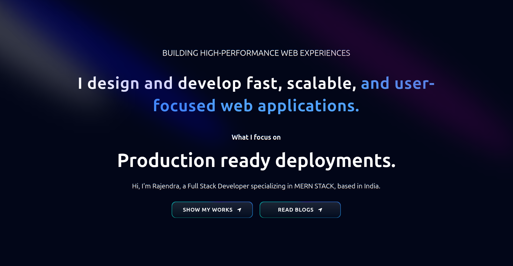

- Project

  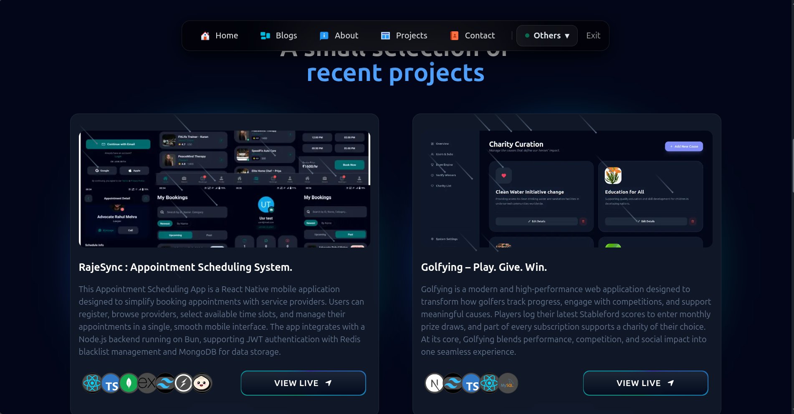

- Approach

  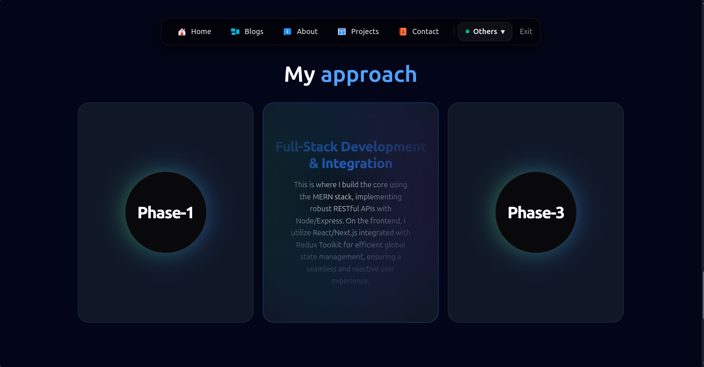

### Blog

- List of Blogs

  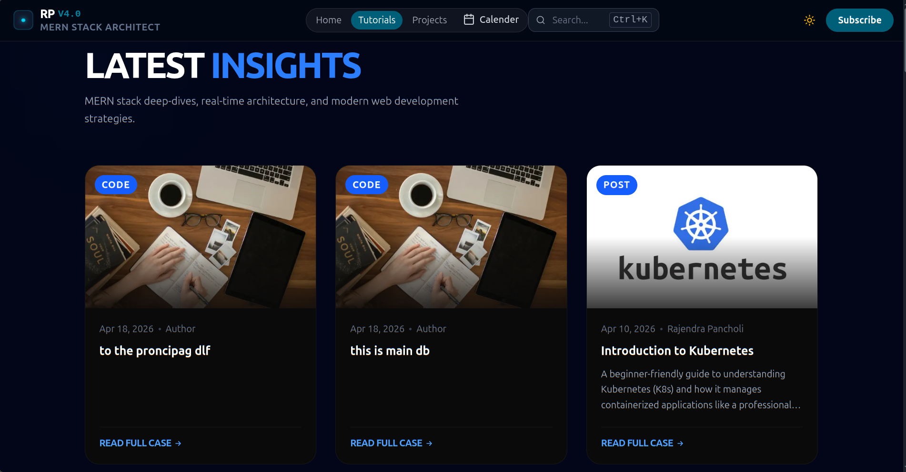

- Blog read page

  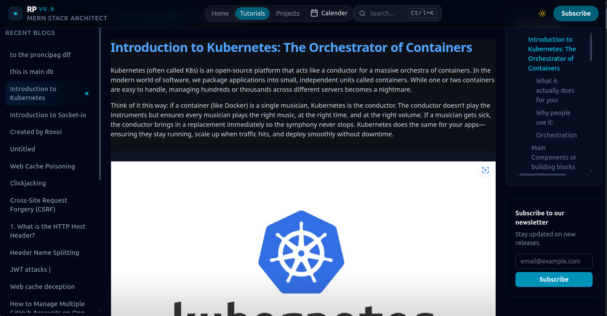

- Blog Search

  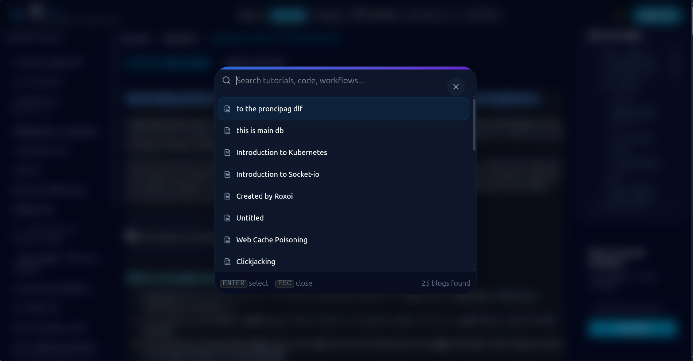

### Admin Users

- Dashboard

  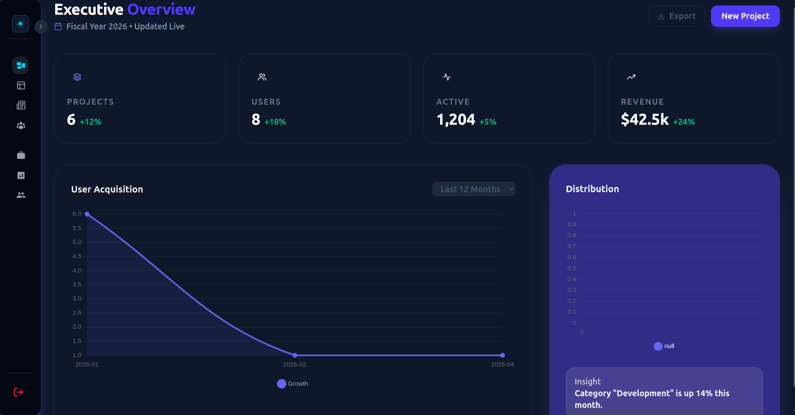

  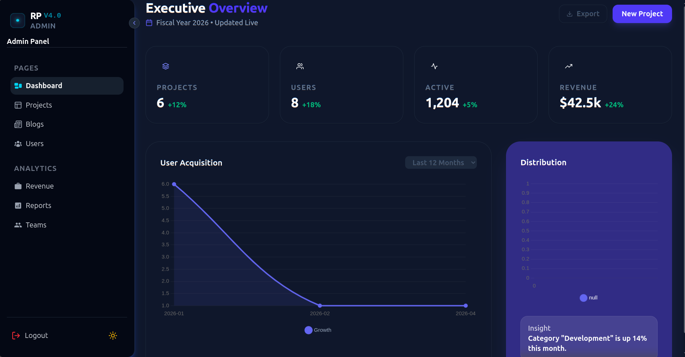

- Projects

  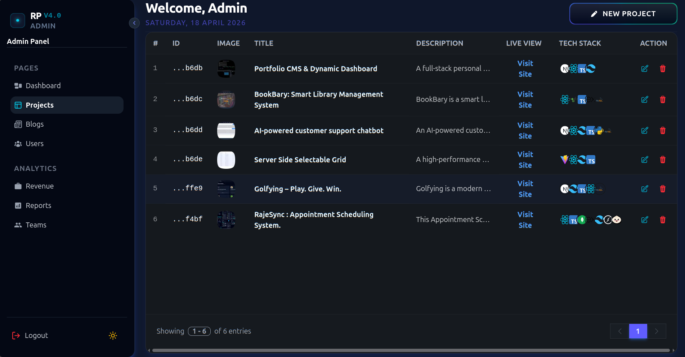

- Create/Manage Project

  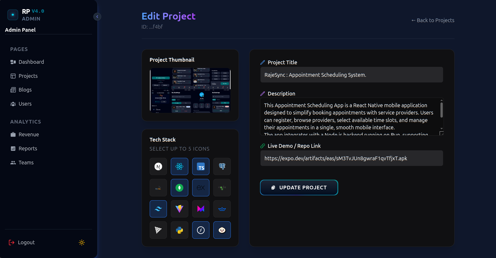

- Blogs

  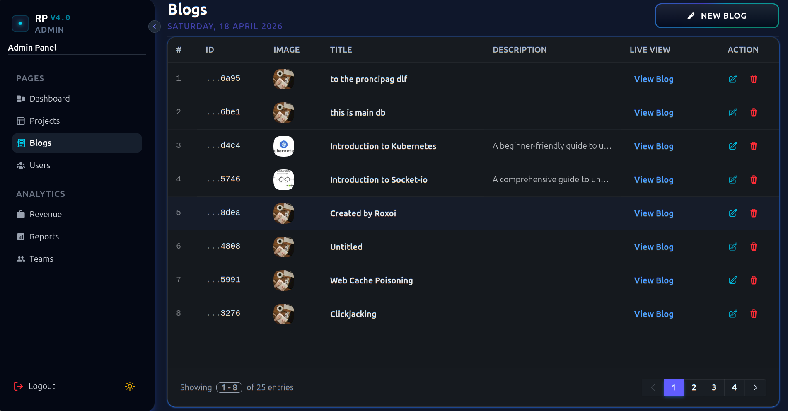

- Create/Manage Blog

  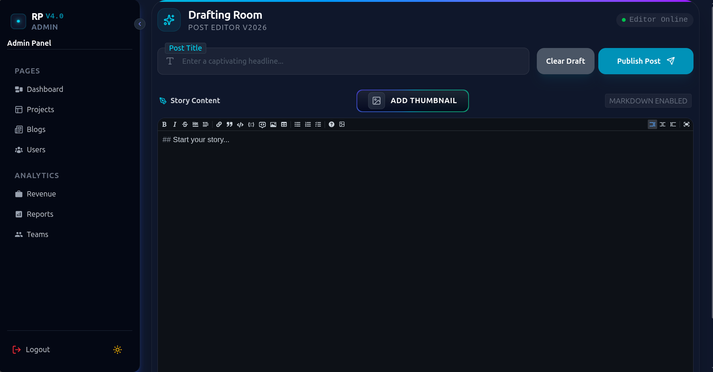

- Users

  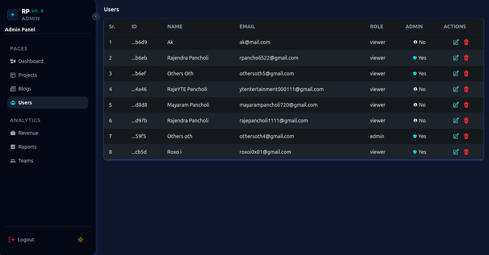

- Create/Manage User
  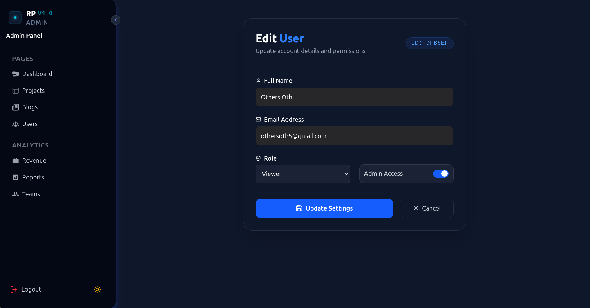

---

## Contributing

1. Fork the repo
2. Create branch

```bash
git checkout -b feature-name
```

3. Commit changes

```bash
git commit -m "add feature"
```

4. Push

```bash
git push origin feature-name
```

5. Open PR

---

## License

MIT License

## Contact

- **Author:** Rajendra Pancholi
- **Website:** [https://rajendrapancholi.com](https://rajendrapancholi.vercel.app)
- **GitHub:** [https://github.com/rajendrapancholi](https://github.com/rajendrapancholi)
- **Email:** [rpancholi522@gmail.com](mailto:rpancholi522@gmail.com)
